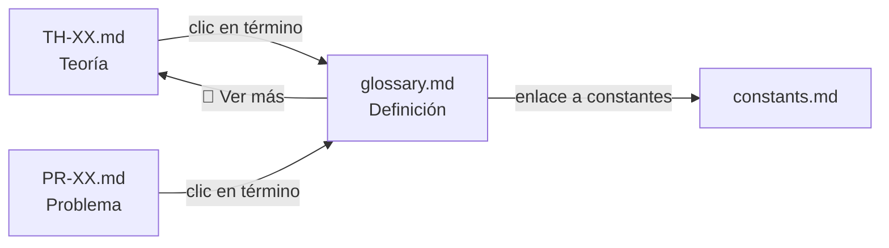

# 🛠️ Herramientas de Automatización

Scripts Python para validación y mantenimiento del repositorio de Circuitos Eléctricos.

---

## 📋 Scripts Disponibles

### 1. `validate_repo.py` - Validador de Estructura

Verifica la estructura de carpetas, archivos requeridos y nomenclatura del repositorio.

```powershell
# Ejecutar validación completa
python validate_repo.py

# Verificar solo un módulo específico
python validate_repo.py --module 01-Circuitos-CD
```

**Verifica:**
- ✅ Estructura de carpetas (theory/, methods/, problems/, simulation/)
- ✅ Archivos requeridos (00-Intro.md, manifest.json, Resumen-Formulas.md)
- ✅ Nomenclatura de archivos (TH-XX, PR-XX, MET-XX, SIM-XX)
- ✅ Validez de manifest.json

---

### 2. `autolink_glossary.py` - Sistema de Hipervinculación Densa

Crea automáticamente enlaces tipo Wikipedia al [glosario](../../glossary.md) en todos los archivos de teoría y problemas.

#### Uso Básico

```powershell
# Vista previa de cambios (dry-run)
python autolink_glossary.py

# Aplicar cambios al repositorio
python autolink_glossary.py --apply

# Verificar enlaces rotos
python autolink_glossary.py --check

# Generar reporte de uso del glosario
python autolink_glossary.py --report
```

#### ¿Qué hace?

1. **Parsea el glosario:** Lee `glossary.md` y extrae todos los términos con sus anclas HTML.
2. **Escanea archivos:** Busca archivos `TH-*.md`, `PR-*.md` y `MET-*.md`.
3. **Inyecta enlaces:** Reemplaza la **primera mención** de cada término del glosario con un enlace Markdown.

#### Ejemplo de Transformación

**Antes:**
```markdown
El capacitor almacena energía en un campo eléctrico.
La corriente en un inductor no puede cambiar instantáneamente.
```

**Después:**
```markdown
El [capacitor](../../../glossary.md#capacitor) almacena energía en un campo eléctrico.
La [corriente](../../../glossary.md#corriente) en un [inductor](../../../glossary.md#inductor) no puede cambiar instantáneamente.
```

#### Características

- ✅ Solo enlaza la **primera mención** de cada término por archivo
- ✅ Respeta bloques de código (\`\`\`) y ecuaciones ($$)
- ✅ No modifica encabezados, tablas ni enlaces existentes
- ✅ Calcula rutas relativas automáticamente
- ✅ Case-insensitive (detecta "Voltaje" y "voltaje")
- ✅ Soporta aliases (LCK → Ley de Corrientes de Kirchhoff)

#### Opciones

| Opción | Descripción |
|--------|-------------|
| `--apply` | Aplicar cambios (sin esto, solo muestra preview) |
| `--check` | Verificar enlaces rotos al glosario |
| `--report` | Generar reporte de uso (`00-META/glossary-report.md`) |
| `-q, --quiet` | Modo silencioso |

---

## 🔄 Flujo de Trabajo Recomendado

### Al agregar nuevo contenido:

1. **Crear archivo** con nomenclatura correcta (ej. `TH-XX-Nombre.md`)
2. **Ejecutar validación:**
   ```powershell
   python validate_repo.py
   ```
3. **Agregar hiperenlaces al glosario:**
   ```powershell
   python autolink_glossary.py        # Vista previa
   python autolink_glossary.py --apply # Aplicar
   ```

### Mantenimiento periódico:

```powershell
# Verificar enlaces rotos
python autolink_glossary.py --check

# Generar reporte de términos no usados
python autolink_glossary.py --report
```

---

## 📁 Archivos Generados

| Archivo | Descripción |
|---------|-------------|
| `00-META/glossary-report.md` | Reporte de uso del glosario |
| `00-META/validation-report.md` | Reporte de validación (si se genera) |

---

## 🔗 Flujo de Navegación (User Flow)



El ciclo de aprendizaje:
1. **Lectura:** Estás en `TH-01` y ves **[capacitor]**
2. **Consulta:** Clic → te lleva a la definición en `glossary.md`
3. **Profundización:** En el glosario, "📖 Ver más" te redirige al módulo específico

---

## ⚙️ Requisitos

- Python 3.8+
- No requiere dependencias externas (solo librería estándar)

```powershell
# Verificar versión de Python
python --version
```
