# 🛠️ Herramientas de Automatización

Scripts Python para validación y mantenimiento del repositorio de Circuitos Eléctricos.

> **Filosofía:** Convertir este repositorio en un "Jardín Digital" interconectado tipo Wikipedia/Zettelkasten.

---

## 📋 Scripts Disponibles

| Script | Función | Estado |
|--------|---------|--------|
| `link_knowledge_base.py` | 🌳 Jardín Digital completo (hipervinculación + índice) | ✅ Principal |
| `autolink_glossary.py` | 🔗 Solo hipervinculación al glosario | ✅ Funcional |
| `validate_repo.py` | ✅ Validación de estructura | ✅ Funcional |

---

## 🌳 `link_knowledge_base.py` - Sistema Jardín Digital (PRINCIPAL)

**Script unificado** que realiza dos tareas principales:

### TAREA 1: Auto-Hipervinculación (Glosario Activo)
- Analiza `glossary.md` y extrae términos (anclas HTML y encabezados h2/h3)
- Escanea todos los `.md` en `theory/`, `problems/`, `methods/`, `simulation/`
- Inyecta enlaces a la **primera mención** de cada término
- Calcula rutas relativas automáticamente
- NO modifica código, encabezados, tablas ni enlaces existentes

### TAREA 2: Generación del Index Wiki
- Genera `WIKI_INDEX.md` como directorio principal de navegación
- Usa el **título H1** de cada archivo como texto del enlace
- Organiza por módulos y submódulos con emojis:
  - 📘 Teoría | 📝 Problemas | 🧪 Métodos | 💻 Simulación

#### Uso

```powershell
# Vista previa (DRY_RUN = True, NO modifica nada)
python link_knowledge_base.py

# Aplicar TODOS los cambios
python link_knowledge_base.py --apply

# Solo generar WIKI_INDEX.md
python link_knowledge_base.py --apply --index-only

# Solo hipervinculación (sin índice)
python link_knowledge_base.py --apply --links-only

# Verificar enlaces rotos
python link_knowledge_base.py --check

# Generar reporte de uso
python link_knowledge_base.py --report
```

#### Opciones

| Opción | Descripción |
|--------|-------------|
| `--apply` | Aplica cambios (sin esto, solo muestra preview) |
| `--index-only` | Solo genera `WIKI_INDEX.md` |
| `--links-only` | Solo ejecuta auto-hipervinculación |
| `--check` | Verifica enlaces rotos al glosario |
| `--report` | Genera `00-META/knowledge-report.md` |
| `-q, --quiet` | Modo silencioso |

---

### 2. `validate_repo.py` - Validador de Estructura

Verifica la estructura de carpetas, archivos requeridos y nomenclatura del repositorio.

```powershell
# Ejecutar validación completa
python validate_repo.py

# Verificar solo un módulo específico
python validate_repo.py --module 01-Circuitos-CD
```

**Verifica:**
- ✅ Estructura de carpetas (theory/, methods/, problems/, simulation/)
- ✅ Archivos requeridos (00-Intro.md, manifest.json, Resumen-Formulas.md)
- ✅ Nomenclatura de archivos (TH-XX, PR-XX, MET-XX, SIM-XX)
- ✅ Validez de manifest.json

---

### 3. `autolink_glossary.py` - Hipervinculación (Legacy)

> ⚠️ **Nota:** Usar `link_knowledge_base.py` preferentemente. Este script se mantiene por compatibilidad.

Crea automáticamente enlaces tipo Wikipedia al [glosario](../../glossary.md) en todos los archivos de teoría y problemas.

#### Uso

```powershell
# Vista previa de cambios (dry-run)
python autolink_glossary.py

# Aplicar cambios al repositorio
python autolink_glossary.py --apply

# Verificar enlaces rotos
python autolink_glossary.py --check

# Generar reporte de uso del glosario
python autolink_glossary.py --report
```

---

## 🔄 Flujo de Trabajo Recomendado

### Al agregar nuevo contenido:

1. **Crear archivo** con nomenclatura correcta (ej. `TH-XX-Nombre.md`)
2. **Ejecutar validación:**
   ```powershell
   python validate_repo.py
   ```
3. **Aplicar Jardín Digital:**
   ```powershell
   python link_knowledge_base.py          # Vista previa
   python link_knowledge_base.py --apply  # Aplicar
   ```

### Mantenimiento periódico:

```powershell
# Verificar enlaces rotos
python link_knowledge_base.py --check

# Regenerar índice wiki
python link_knowledge_base.py --apply --index-only

# Generar reporte de términos
python link_knowledge_base.py --report
```

---

## 📁 Archivos Generados

| Archivo | Descripción |
|---------|-------------|
| `WIKI_INDEX.md` | 📑 Directorio principal de navegación (raíz) |
| `00-META/knowledge-report.md` | 📊 Reporte completo del Jardín Digital |
| `00-META/glossary-report.md` | 📊 Reporte de uso del glosario (legacy) |

---

## 🔗 Flujo de Navegación (User Flow)

```mermaid
flowchart LR
    TH[TH-XX.md<br>Teoría] -->|clic en término| GL[glossary.md<br>Definición]
    PR[PR-XX.md<br>Problema] -->|clic en término| GL
    GL -->|"📖 Ver más"| TH
    GL -->|enlace a constantes| CT[constants.md]
```



El ciclo de aprendizaje:
1. **Lectura:** Estás en `TH-01` y ves **[capacitor]**
2. **Consulta:** Clic → te lleva a la definición en `glossary.md`
3. **Profundización:** En el glosario, "📖 Ver más" te redirige al módulo específico

---

## ⚙️ Requisitos

- Python 3.8+
- No requiere dependencias externas (solo librería estándar)

```powershell
# Verificar versión de Python
python --version
```
