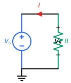
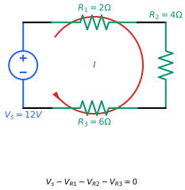

<!--
::METADATA::
type: theory
topic_id: cd-01-conceptos-leyes-fundamentales
file_id: TH-05-Ley-Ohm-Leyes-Kirchhoff
status: stable
audience: both
last_updated: 2026-01-05
-->

# TH-05: Ley de Ohm y Leyes de Kirchhoff

## Objetivos
- Aplicar la [Ley de Ohm](../../../glossary.md#ley-[ohm](../../../glossary.md#[ohm](../../../glossary.md#ley-ohm)-unidad)) en el análisis de circuitos
- Comprender y aplicar la [Ley de Corrientes de [Kirchhoff](../../../glossary.md#lck) (LCK)](../../../glossary.md#lck)
- Comprender y aplicar la [Ley de Voltajes de [Kirchhoff](../../../glossary.md#lvk) (LVK)](../../../glossary.md#lvk)

## Contenido

### Ley de Ohm

La relación entre [voltaje](../../../glossary.md#[voltaje](../../../glossary.md#voltaje)) y [corriente](../../../glossary.md#[corriente](../../../glossary.md#corriente)) en un [resistor](../../../glossary.md#[resistencia](../../../glossary.md#resistencia)) es:

$$v = iR$$

*Figura 1: Circuito básico ilustrando la Ley de Ohm: V = IR*

Donde:
- v = voltaje (V)
- i = corriente (A)
- R = [resistencia](../../../glossary.md#resistencia) (Ω)

**Formas equivalentes:**
- $i = \frac{v}{R}$
- $R = \frac{v}{i}$

**Potencia en un resistor:**
$$p = vi = i²R = \frac{v²}{R}$$

### Ley de Corrientes de Kirchhoff (LCK)

> La suma algebraica de las corrientes que entran a un [nodo](../../../glossary.md#nodo) es igual a cero.

$$\sum_{k=1}^{n} i_k = 0$$

*Figura 2: Ilustración de LCK - Las corrientes que entran a un nodo igualan a las que salen*

**Equivalentemente:** La suma de corrientes que entran a un nodo es igual a la suma de corrientes que salen.

$$\sum i_{entran} = \sum i_{salen}$$

### Ley de Voltajes de Kirchhoff (LVK)

> La suma algebraica de los voltajes alrededor de cualquier trayectoria cerrada ([malla](../../../glossary.md#malla)) es igual a cero.

$$\sum_{k=1}^{n} v_k = 0$$

*Figura 3: Ilustración de LVK - La suma de voltajes en una malla cerrada es cero*

**Equivalentemente:** La suma de las elevaciones de voltaje es igual a la suma de las caídas de voltaje.

$$\sum v_{elevaciones} = \sum v_{caídas}$$

### Convenciones de Signos

**Para LCK:**
- Corriente entrando al [nodo](../../../glossary.md#nodo): positiva (+)
- Corriente saliendo del nodo: negativa (-)

**Para LVK (recorriendo la [malla](../../../glossary.md#malla)):**
- Si se recorre de - a +: elevación (+)
- Si se recorre de + a -: caída (-)

### Ejemplo de Aplicación

Considere un circuito con fuente de 12V y tres resistencias: R₁ = 2Ω, R₂ = 4Ω, R₃ = 6Ω.

Aplicando LVK en la malla: $12 - 2i_1 - 4i_2 = 0$

Para más ejemplos visuales, consulte la [Figura 3 de LVK](#figura-3).

## Conceptos Clave
- Resistencia y conductancia (G = 1/R)
- Conservación de [carga](../../../glossary.md#carga) (LCK)
- Conservación de energía (LVK)
- Nodo, rama y malla
