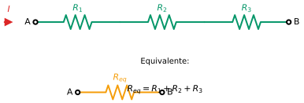
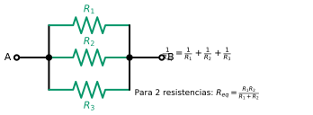

# TH-07: Combinación de Resistencias y Fuentes

## Objetivos
- Combinar resistencias en serie y paralelo
- Realizar transformaciones [delta](../../../glossary.md#delta)-[estrella](../../../glossary.md#estrella) (Δ-Y) y viceversa
- Combinar fuentes de [voltaje](../../../glossary.md#voltaje) y [corriente](../../../glossary.md#corriente)

## Contenido

### Resistencias en Serie

*Figura 1: Resistencias en serie - La resistencia equivalente es la suma de todas*

$$R_{eq} = R_1 + R_2 + R_3 + ... + R_n$$

### Resistencias en Paralelo

*Figura 2: Resistencias en paralelo - La conductancia equivalente es la suma de conductancias*

$$\frac{1}{R_{eq}} = \frac{1}{R_1} + \frac{1}{R_2} + ... + \frac{1}{R_n}$$

**Caso especial (dos resistencias):**
$$R_{eq} = \frac{R_1 \cdot R_2}{R_1 + R_2} = R_1 \| R_2$$

**Caso especial (n resistencias iguales):**
$$R_{eq} = \frac{R}{n}$$

### Transformación Delta-Estrella (Δ → Y)

<table>
<tr>
<td>

**Configuración Delta (Δ):**
- Ra conecta nodos a-b
- Rb conecta nodos a-c  
- Rc conecta nodos b-c

</td>
<td>

**Configuración Estrella (Y):**
- R₁ conecta nodo a al centro
- R₂ conecta nodo b al centro
- R₃ conecta nodo c al centro

</td>
</tr>
</table>

**De Delta a Estrella:**
$$R_1 = \frac{R_a \cdot R_b}{R_a + R_b + R_c}$$
$$R_2 = \frac{R_b \cdot R_c}{R_a + R_b + R_c}$$
$$R_3 = \frac{R_a \cdot R_c}{R_a + R_b + R_c}$$

### Transformación Estrella-Delta (Y → Δ)

**De Estrella a Delta:**
$$R_a = \frac{R_1 R_2 + R_2 R_3 + R_1 R_3}{R_3}$$
$$R_b = \frac{R_1 R_2 + R_2 R_3 + R_1 R_3}{R_2}$$
$$R_c = \frac{R_1 R_2 + R_2 R_3 + R_1 R_3}{R_1}$$

**Caso especial (resistencias iguales):**
- Si Ra = Rb = Rc = RΔ → R₁ = R₂ = R₃ = RΔ/3
- Si R₁ = R₂ = R₃ = RY → Ra = Rb = Rc = 3RY

### Combinación de Fuentes de Voltaje

**En serie:**
- Misma polaridad: Veq = V₁ + V₂
- Polaridad opuesta: Veq = V₁ - V₂

**En paralelo:**
- Solo si tienen el mismo voltaje (de lo contrario, violación de [LVK](../../../glossary.md#lvk))

### Combinación de Fuentes de Corriente

**En paralelo:**
- Mismo sentido: Ieq = I₁ + I₂
- Sentido opuesto: Ieq = I₁ - I₂

**En serie:**
- Solo si tienen la misma corriente (de lo contrario, violación de [LCK](../../../glossary.md#lck))

## Conceptos Clave
- Reducción de circuitos
- Transformaciones Δ-Y y Y-Δ
- Restricciones en combinación de fuentes
