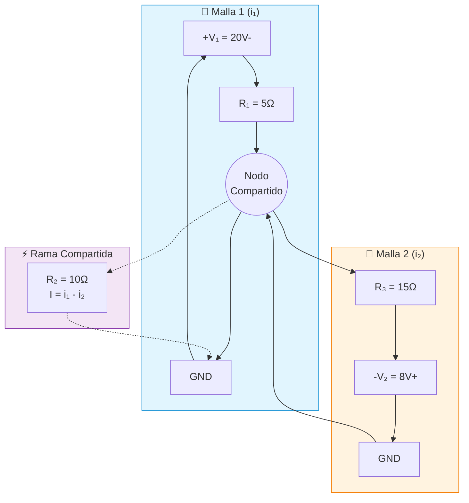

# PR-03: Análisis de Mallas - Dos Mallas ⭐⭐

## Enunciado
Utilizando el método de mallas, determine las corrientes de [malla](../../../glossary.md#malla) i₁ e i₂, y calcule la potencia entregada por cada fuente.
- V₁ = 20V, V₂ = 8V
- R₁ = 5Ω, R₂ = 10Ω, R₃ = 15Ω

## 📚 Teoría Relacionada
> Antes de resolver, revisa los conceptos fundamentales:
> - [TH-03: Método de Mallas, Eslabones y Lazos](../theory/TH-03-Metodo-mallas-eslabones-lazos.md) - Fundamento teórico del análisis de mallas
> - [TH-01: Topología de Redes](../theory/TH-01-Topologia-redes.md) - Conceptos de mallas y lazos
> - [Glosario: Malla](../../../glossary.md#m) | [LVK](../../../glossary.md#k)

## Diagrama del Circuito

```
         i₁→           i₂→
    ┌────────┐    ┌────────┐
    │   R₁   │    │   R₃   │
    ↓  5Ω   ↓    ↓  15Ω   ↓
  + │ ┌──/\/\/──┬──/\/\/──┐ │ -
(V₁)│ │         │         │ │(V₂)
 20V│ │        R₂         │ │ 8V
  - │ │        10Ω        │ │ +
    │ │         │         │ │
    └─┴─────────┴─────────┴─┘
```

**Con corrientes de malla:**
```
       ┌───/\/\/──────┬────/\/\/───┐
       │    R₁=5Ω     │    R₃=15Ω  │
     + │              │            │ -
    (V₁)    i₁ ⟳     R₂    i₂ ⟳  (V₂)
     20V             10Ω           8V
     - │              │            │ +
       │              │            │
       └──────────────┴────────────┘
```

**Diagrama de flujo del método de mallas (Mermaid):**


## Netlist SPICE

```spice
* PR-03: Analisis de Mallas - Dos Mallas
* Circuito con dos fuentes de voltaje

V1 1 0 DC 20V      ; Fuente V1 = 20V
V2 0 3 DC 8V       ; Fuente V2 = 8V (polaridad invertida)
R1 1 2 5           ; R1 = 5Ω
R2 2 0 10          ; R2 = 10Ω (rama compartida)
R3 2 3 15          ; R3 = 15Ω

.OP
.PRINT DC I(V1) I(V2) I(R1) I(R2) I(R3)
.END
```

## Solución

### Datos
- V₁ = 20 V, V₂ = 8 V
- R₁ = 5 Ω, R₂ = 10 Ω, R₃ = 15 Ω
- Corrientes de malla: i₁ (izquierda, horario), i₂ (derecha, horario)

### Paso 1: Ecuación de la Malla 1 (LVK)

Recorriendo en sentido horario:
$$-V_1 + i_1 R_1 + (i_1 - i_2) R_2 = 0$$

$$-20 + 5i_1 + 10(i_1 - i_2) = 0$$

$$-20 + 5i_1 + 10i_1 - 10i_2 = 0$$

$$15i_1 - 10i_2 = 20 \quad \text{...(1)}$$

### Paso 2: Ecuación de la Malla 2 (LVK)

Recorriendo en sentido horario:
$$(i_2 - i_1) R_2 + i_2 R_3 + V_2 = 0$$

$$10(i_2 - i_1) + 15i_2 + 8 = 0$$

$$-10i_1 + 10i_2 + 15i_2 = -8$$

$$-10i_1 + 25i_2 = -8 \quad \text{...(2)}$$

### Paso 3: Resolver el sistema

**Forma matricial:**
$$\begin{bmatrix} 15 & -10 \\ -10 & 25 \end{bmatrix} \begin{bmatrix} i_1 \\ i_2 \end{bmatrix} = \begin{bmatrix} 20 \\ -8 \end{bmatrix}$$

**Determinante:**
$$\Delta = (15)(25) - (-10)(-10) = 375 - 100 = 275$$

**Por regla de Cramer:**
$$i_1 = \frac{\begin{vmatrix} 20 & -10 \\ -8 & 25 \end{vmatrix}}{275} = \frac{(20)(25) - (-10)(-8)}{275} = \frac{500 - 80}{275} = \frac{420}{275} = 1.527\text{ A}$$

$$i_2 = \frac{\begin{vmatrix} 15 & 20 \\ -10 & -8 \end{vmatrix}}{275} = \frac{(15)(-8) - (20)(-10)}{275} = \frac{-120 + 200}{275} = \frac{80}{275} = 0.291\text{ A}$$

### Paso 4: Corrientes de rama

**[Corriente](../../../glossary.md#corriente) por R₁:**
$$I_{R1} = i_1 = 1.527\text{ A}$$

**Corriente por R₂ (rama compartida):**
$$I_{R2} = i_1 - i_2 = 1.527 - 0.291 = 1.236\text{ A}$$

**Corriente por R₃:**
$$I_{R3} = i_2 = 0.291\text{ A}$$

### Paso 5: Potencia de las fuentes

**Potencia de V₁:**
$$P_{V1} = V_1 \cdot i_1 = (20)(1.527) = 30.55\text{ W}$$

Como la corriente sale del terminal positivo, V₁ **entrega** potencia.

**Potencia de V₂:**
$$P_{V2} = V_2 \cdot i_2 = (8)(0.291) = 2.33\text{ W}$$

Como la corriente entra al terminal positivo (por la orientación), V₂ **absorbe** potencia.

### Verificación: Balance de potencia

**Potencia disipada en resistencias:**
$$P_{R1} = i_1^2 R_1 = (1.527)^2(5) = 11.66\text{ W}$$
$$P_{R2} = (i_1-i_2)^2 R_2 = (1.236)^2(10) = 15.28\text{ W}$$
$$P_{R3} = i_2^2 R_3 = (0.291)^2(15) = 1.27\text{ W}$$

$$P_{disipada} = 11.66 + 15.28 + 1.27 = 28.21\text{ W}$$

$$P_{entregada} - P_{absorbida} = 30.55 - 2.33 = 28.22\text{ W} \approx P_{disipada} \checkmark$$

## Respuestas

| Variable | Valor |
|----------|-------|
| i₁ | **1.527 A** |
| i₂ | **0.291 A** |
| I_{R1} | **1.527 A** |
| I_{R2} | **1.236 A** |
| I_{R3} | **0.291 A** |
| P_{V1} | **30.55 W (entrega)** |
| P_{V2} | **2.33 W (absorbe)** |

## Simulación SPICE - Resultados Esperados
```
Operating Point:
I(V1) = -1.5273E+00  (corriente sale de V1)
I(R1) = 1.5273E+00
I(R2) = 1.2364E+00
I(R3) = 2.9091E-01
```

## Conceptos Aplicados
- Método de mallas
- Corriente de rama = suma algebraica de corrientes de malla
- Balance de potencia
- Convención de signos