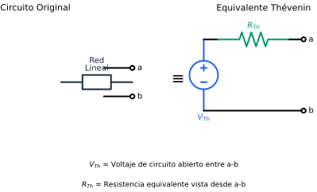

# TH-02: Teoremas de Thévenin y Norton

## Objetivos
- Obtener el equivalente de [Thévenin](../../../glossary.md#[thevenin](../../../glossary.md#thevenin)) de un [circuito](../../../glossary.md#circuito)
- Obtener el equivalente de [Norton](../../../glossary.md#[norton](../../../glossary.md#norton)) de un circuito
- Relacionar ambos equivalentes

## Contenido

### Teorema de Thévenin

> Cualquier [circuito](../../../glossary.md#circuito) lineal de dos terminales puede reemplazarse por un circuito equivalente que consiste en una fuente de [voltaje](../../../glossary.md#voltaje) Vₙₕ en serie con una [resistencia](../../../glossary.md#resistencia) Rₙₕ.

*Figura 1: Transformación de un circuito lineal a su equivalente de Thévenin*

### Teorema de Norton

> Cualquier [circuito](../../../glossary.md#circuito) lineal de dos terminales puede reemplazarse por un circuito equivalente que consiste en una fuente de [corriente](../../../glossary.md#corriente) Iₙ en paralelo con una [resistencia](../../../glossary.md#resistencia) Rₙ.

*Figura 2: Transformación de un circuito lineal a su equivalente de Norton*

### Cálculo de Parámetros

**[Voltaje](../../../glossary.md#voltaje) de Thévenin (Vₜₕ):**
Voltaje de circuito abierto entre los terminales a y b.
$$V_{th} = V_{ab(circuito\ abierto)}$$

**Corriente de Norton (Iₙ):**
Corriente de cortocircuito entre los terminales a y b.
$$I_N = I_{ab(cortocircuito)}$$

**[Resistencia](../../../glossary.md#resistencia) equivalente (Rₜₕ = Rₙ):**

*Método 1:* Apagar todas las fuentes independientes y calcular la resistencia vista desde a-b.

*Método 2:* 
$$R_{th} = \frac{V_{th}}{I_N}$$

*Método 3 (circuitos con dependientes):* Aplicar fuente de prueba.

### Relación Thévenin-Norton

$$V_{th} = I_N \cdot R_{th}$$
$$I_N = \frac{V_{th}}{R_{th}}$$
$$R_{th} = R_N$$

### Procedimiento Paso a Paso

1. **Identificar** los terminales de interés (a, b)
2. **Desconectar** la [carga](../../../glossary.md#carga)
3. **Calcular Vₜₕ:** voltaje entre a y b (circuito abierto)
4. **Calcular Rₜₕ:** 
   - Apagar fuentes independientes
   - Medir resistencia entre a y b
5. **Dibujar** el equivalente con carga reconectada

### Ejemplo

Considere un circuito con: fuente de 12V, R = 4Ω en serie con la fuente, R = 6Ω en paralelo al nodo, y R = 2Ω hacia los terminales a-b.

**Vₜₕ:** Divisor de voltaje
$$V_{th} = 12 \times \frac{6}{4+6} = 7.2V$$

**Rₜₕ:** (fuente apagada)
$$R_{th} = 2 + (4 \| 6) = 2 + 2.4 = 4.4Ω$$

> **Nota:** Consulte las Figuras 1 y 2 para visualizar los circuitos equivalentes de Thévenin y Norton.

## Aplicaciones
- Simplificación de circuitos
- Análisis de carga variable
- Cálculo de máxima transferencia de potencia

## Conceptos Clave
- Equivalencia de terminales
- Tres métodos para calcular Rₜₕ
- Conversión Thévenin ↔ Norton
