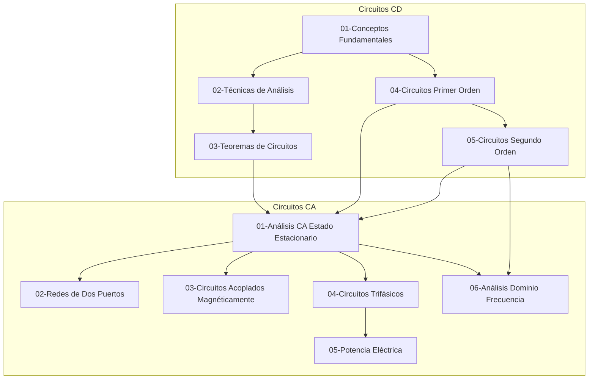

# CIRCUITOS-ELECTRICOS
Cursos de Circuitos Eléctricos de Ingeniería Electrónica

## 📚 Estructura del Repositorio

Este repositorio está organizado en dos ramas principales de estudio:

### 🔋 [01-Circuitos de Corriente Directa (CD)](01-Circuitos-CD/00-Index.md)

Fundamentos y análisis de circuitos de corriente directa.

| Módulo | Descripción | Temas |
|--------|-------------|-------|
| [01-Conceptos y Leyes Fundamentales](01-Circuitos-CD/01-Conceptos-Leyes-Fundamentales/00-Intro.md) | Bases de circuitos eléctricos | 9 |
| [02-Técnicas de Análisis](01-Circuitos-CD/02-Tecnicas-Analisis-Circuitos/00-Intro.md) | Métodos de nodos y mallas | 3 |
| [03-Teoremas de Circuitos](01-Circuitos-CD/03-Teoremas-Circuitos/00-Intro.md) | Thévenin, Norton, Superposición | 4 |
| [04-Circuitos de Primer Orden](01-Circuitos-CD/04-Circuitos-Primer-Orden/00-Intro.md) | Circuitos RL y RC | 7 |
| [05-Circuitos de Segundo Orden](01-Circuitos-CD/05-Circuitos-Segundo-Orden/00-Intro.md) | Circuitos RLC | 2 |

### ⚡ [02-Circuitos de Corriente Alterna (CA)](02-Circuitos-CA/00-Index.md)

Análisis de circuitos de corriente alterna y aplicaciones avanzadas.

| Módulo | Descripción | Temas |
|--------|-------------|-------|
| [01-Análisis CA Estado Estacionario](02-Circuitos-CA/01-Analisis-CA-Estado-Estacionario/00-Intro.md) | Fasores, impedancia, teoremas CA | 8 |
| [02-Redes de Dos Puertos](02-Circuitos-CA/02-Redes-Dos-Puertos/00-Intro.md) | Parámetros z, y, h, ABCD | 3 |
| [03-Circuitos Acoplados Magnéticamente](02-Circuitos-CA/03-Circuitos-Acoplados-Magneticamente/00-Intro.md) | Transformadores | 5 |
| [04-Circuitos Trifásicos](02-Circuitos-CA/04-Circuitos-Trifasicos/00-Intro.md) | Sistemas trifásicos | 3 |
| [05-Potencia Eléctrica](02-Circuitos-CA/05-Potencia-Electrica/00-Intro.md) | Potencia compleja, factor de potencia | 3 |
| [06-Análisis Dominio Frecuencia](02-Circuitos-CA/06-Analisis-Dominio-Frecuencia/00-Intro.md) | Resonancia, filtros | 5 |

## 🗺️ Mapa de Dependencias (Skill Tree)



## 📖 Recursos Adicionales

- [📚 Glosario de Términos](glossary.md)
- [⚡ Constantes Físicas](constants.md) — Constantes de electricidad y magnetismo
- [🔣 Símbolos y Notación](00-META/notation-cheatsheet.md)
- [📝 Guía de Estudio](00-META/study-guide.md)
- [📋 Nomenclatura Estándar](00-META/nomenclatura-estandar.md)

## 📁 Estructura de Cada Módulo

```
XX-Nombre-Modulo/
├── 00-Intro.md           # Introducción y objetivos
├── theory/               # Archivos de teoría (TH-XX)
├── methods/              # Métodos y procedimientos (MT-XX)
├── problems/             # Problemas y ejercicios (PR-XX, EJ-XX)
├── simulation/           # Simulaciones Proteus 8.15 (SIM-XX)
├── media/                # Figuras generadas (fig_XX.svg/png)
├── Resumen-Formulas.md   # Fórmulas importantes
└── manifest.json         # Metadatos del módulo
```

## 🎨 Sistema de Figuras

Los diagramas de circuitos se generan automáticamente usando **schemdraw** (Python).

```bash
# Generar todas las figuras
cd 00-META/tools
pip install -r requirements.txt
python generate_figs.py
```

📷 **Figuras disponibles:** Ver [Recursos Multimedia en WIKI_INDEX](WIKI_INDEX.md#-recursos-multimedia)

## 🎯 Niveles de Dificultad

| Nivel | Símbolo | Descripción |
|-------|---------|-------------|
| Conceptual | ⭐ | Aplicación directa de fórmulas |
| Intermedio | ⭐⭐ | Requiere sistemas de ecuaciones |
| Avanzado | ⭐⭐⭐ | Circuitos complejos, fuentes dependientes |

## 🏷️ Nomenclatura de Archivos

| Prefijo | Tipo de Contenido | Ubicación |
|---------|-------------------|-----------|
| `TH-XX` | Teoría | `theory/` |
| `MT-XX` | Métodos/Procedimientos | `methods/` |
| `PR-XX` | Problemas resueltos | `problems/` |
| `EJ-XX` | Ejercicios propuestos | `problems/` |
| `SIM-XX` | Simulaciones Proteus | `simulation/` |

## 🔧 Herramientas de Simulación

- **Software:** Proteus 8.15
- **Modelos SPICE:** [00-META/spice-models/](00-META/spice-models/)

## 📊 Estado del Repositorio

| Módulo | Estado |
|--------|--------|
| 01-Circuitos-CD | 🔄 En desarrollo |
| 02-Circuitos-CA | 🔄 En desarrollo |

---

*Repositorio de estudio para cursos de Circuitos Eléctricos de Ingeniería Electrónica*
