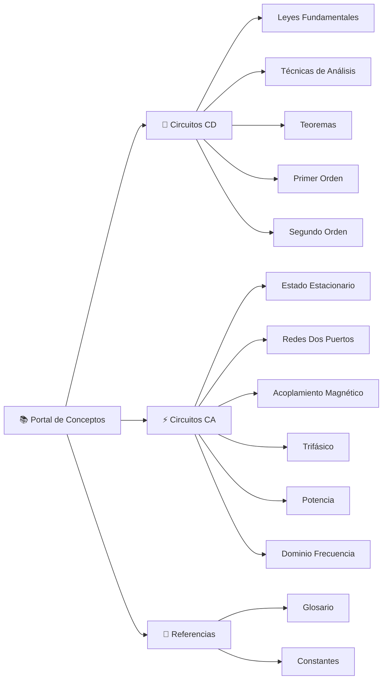

# 📚 Portal de Conceptos - Circuitos Eléctricos

> **Navegación tipo Wikipedia** — Explora todos los conceptos organizados por tema y subtema.
> 
> 🔗 Ver también: [README Principal](README.md) | [Glosario Completo](glossary.md) | [Constantes Físicas](constants.md)

---

## 🗺️ Mapa de Navegación

---

## 🔋 Circuitos de Corriente Directa (CD)

### 01 — Conceptos y Leyes Fundamentales

#### 📐 Magnitudes Básicas
| Concepto | Definición | Teoría | Problemas |
|----------|------------|--------|-----------|
| [Carga eléctrica](glossary.md#carga) | Propiedad fundamental, medida en Coulombs | [TH-03](01-Circuitos-CD/01-Conceptos-Leyes-Fundamentales/theory/TH-03-Carga-corriente-tension-potencia.md) | — |
| [Corriente](glossary.md#corriente) | Flujo de carga por unidad de tiempo | [TH-03](01-Circuitos-CD/01-Conceptos-Leyes-Fundamentales/theory/TH-03-Carga-corriente-tension-potencia.md) | — |
| [Voltaje](glossary.md#voltaje) | Diferencia de potencial eléctrico | [TH-03](01-Circuitos-CD/01-Conceptos-Leyes-Fundamentales/theory/TH-03-Carga-corriente-tension-potencia.md) | — |
| [Resistencia](glossary.md#resistencia) | Oposición al flujo de corriente | [TH-05](01-Circuitos-CD/01-Conceptos-Leyes-Fundamentales/theory/TH-05-Ley-Ohm-Leyes-Kirchhoff.md) | [PR-02](01-Circuitos-CD/01-Conceptos-Leyes-Fundamentales/problems/PR-02-Resistencias-Serie.md), [PR-03](01-Circuitos-CD/01-Conceptos-Leyes-Fundamentales/problems/PR-03-Resistencias-Paralelo.md) |

#### ⚖️ Leyes Fundamentales
| Concepto | Definición | Teoría | Problemas |
|----------|------------|--------|-----------|
| [Ley de Ohm](glossary.md#ley-ohm) | V = IR | [TH-05](01-Circuitos-CD/01-Conceptos-Leyes-Fundamentales/theory/TH-05-Ley-Ohm-Leyes-Kirchhoff.md) | [PR-01](01-Circuitos-CD/01-Conceptos-Leyes-Fundamentales/problems/PR-01-Ley-Ohm-Basico.md) |
| [LCK - Ley de Corrientes](glossary.md#lck) | ΣI = 0 en un nodo | [TH-05](01-Circuitos-CD/01-Conceptos-Leyes-Fundamentales/theory/TH-05-Ley-Ohm-Leyes-Kirchhoff.md) | [PR-03](01-Circuitos-CD/01-Conceptos-Leyes-Fundamentales/problems/PR-03-Resistencias-Paralelo.md) |
| [LVK - Ley de Voltajes](glossary.md#lvk) | ΣV = 0 en una malla | [TH-05](01-Circuitos-CD/01-Conceptos-Leyes-Fundamentales/theory/TH-05-Ley-Ohm-Leyes-Kirchhoff.md) | [PR-08](01-Circuitos-CD/01-Conceptos-Leyes-Fundamentales/problems/PR-08-Leyes-Kirchhoff-Dos-Mallas.md) |

#### 🔀 Divisores y Transformaciones
| Concepto | Definición | Teoría | Problemas |
|----------|------------|--------|-----------|
| [Divisor de tensión](glossary.md#divisor-tension) | Divide voltaje en resistencias serie | [TH-08](01-Circuitos-CD/01-Conceptos-Leyes-Fundamentales/theory/TH-08-Divisores-tension-corriente.md) | [PR-04](01-Circuitos-CD/01-Conceptos-Leyes-Fundamentales/problems/PR-04-Divisor-Tension.md) |
| [Divisor de corriente](glossary.md#divisor-corriente) | Divide corriente en ramas paralelas | [TH-08](01-Circuitos-CD/01-Conceptos-Leyes-Fundamentales/theory/TH-08-Divisores-tension-corriente.md) | [PR-05](01-Circuitos-CD/01-Conceptos-Leyes-Fundamentales/problems/PR-05-Divisor-Corriente.md) |
| [Delta (Δ)](glossary.md#delta) | Configuración triangular | [TH-07](01-Circuitos-CD/01-Conceptos-Leyes-Fundamentales/theory/TH-07-Combinacion-resistencias-fuentes.md) | [PR-07](01-Circuitos-CD/01-Conceptos-Leyes-Fundamentales/problems/PR-07-Transformacion-Delta-Estrella.md) |
| [Estrella (Y)](glossary.md#estrella) | Configuración con punto común | [TH-07](01-Circuitos-CD/01-Conceptos-Leyes-Fundamentales/theory/TH-07-Combinacion-resistencias-fuentes.md) | [PR-07](01-Circuitos-CD/01-Conceptos-Leyes-Fundamentales/problems/PR-07-Transformacion-Delta-Estrella.md) |

---

### 02 — Técnicas de Análisis de Circuitos

#### 🔗 Topología
| Concepto | Definición | Teoría | Problemas |
|----------|------------|--------|-----------|
| [Nodo](glossary.md#nodo) | Punto de conexión de 2+ elementos | [TH-01](01-Circuitos-CD/02-Tecnicas-Analisis-Circuitos/theory/TH-01-Topologia-redes.md) | — |
| [Malla](glossary.md#malla) | Trayectoria cerrada sin otras trayectorias | [TH-01](01-Circuitos-CD/02-Tecnicas-Analisis-Circuitos/theory/TH-01-Topologia-redes.md) | — |

#### 📊 Métodos de Análisis
| Concepto | Descripción | Teoría | Problemas |
|----------|-------------|--------|-----------|
| Análisis Nodal | Aplicación sistemática de LCK | [TH-02](01-Circuitos-CD/02-Tecnicas-Analisis-Circuitos/theory/TH-02-Metodo-nodos.md) | [PR-01](01-Circuitos-CD/02-Tecnicas-Analisis-Circuitos/problems/PR-01-Analisis-Nodal-Tres-Nodos.md), [PR-02](01-Circuitos-CD/02-Tecnicas-Analisis-Circuitos/problems/PR-02-Analisis-Nodal-Supernodo.md) |
| Análisis de Mallas | Aplicación sistemática de LVK | [TH-03](01-Circuitos-CD/02-Tecnicas-Analisis-Circuitos/theory/TH-03-Metodo-mallas-eslabones-lazos.md) | [PR-03](01-Circuitos-CD/02-Tecnicas-Analisis-Circuitos/problems/PR-03-Analisis-Mallas-Dos-Mallas.md), [PR-04](01-Circuitos-CD/02-Tecnicas-Analisis-Circuitos/problems/PR-04-Analisis-Mallas-Supermalla.md) |

---

### 03 — Teoremas de Circuitos

| Concepto | Definición | Teoría | Problemas |
|----------|------------|--------|-----------|
| [Superposición](glossary.md#superposicion) | Respuesta total = suma de respuestas individuales | [TH-01](01-Circuitos-CD/03-Teoremas-Circuitos/theory/TH-01-Linealidad-superposicion.md) | [PR-01](01-Circuitos-CD/03-Teoremas-Circuitos/problems/PR-01-Superposicion.md) |
| [Thévenin](glossary.md#thevenin) | Equivalente: V_th en serie con R_th | [TH-02](01-Circuitos-CD/03-Teoremas-Circuitos/theory/TH-02-Teoremas-Thevenin-Norton.md) | [PR-02](01-Circuitos-CD/03-Teoremas-Circuitos/problems/PR-02-Teorema-Thevenin.md) |
| [Norton](glossary.md#norton) | Equivalente: I_N en paralelo con R_N | [TH-02](01-Circuitos-CD/03-Teoremas-Circuitos/theory/TH-02-Teoremas-Thevenin-Norton.md) | [PR-03](01-Circuitos-CD/03-Teoremas-Circuitos/problems/PR-03-Teorema-Norton.md) |
| Máxima Transferencia | P_max cuando R_L = R_th | [TH-03](01-Circuitos-CD/03-Teoremas-Circuitos/theory/TH-03-Maxima-transferencia-potencia.md) | [PR-04](01-Circuitos-CD/03-Teoremas-Circuitos/problems/PR-04-Maxima-Transferencia-Potencia.md) |

---

### 04 — Circuitos de Primer Orden

#### 🔌 Elementos Almacenadores
| Concepto | Definición | Teoría | Problemas |
|----------|------------|--------|-----------|
| [Capacitancia](glossary.md#capacitancia) | Almacena energía en campo eléctrico | [TH-01](01-Circuitos-CD/04-Circuitos-Primer-Orden/theory/TH-01-Inductancia-capacitancia-combinaciones.md) | — |
| [Inductancia](glossary.md#inductancia) | Almacena energía en campo magnético | [TH-01](01-Circuitos-CD/04-Circuitos-Primer-Orden/theory/TH-01-Inductancia-capacitancia-combinaciones.md) | — |

#### ⏱️ Respuesta Transitoria
| Circuito | Constante τ | Teoría | Problemas |
|----------|-------------|--------|-----------|
| RC (Descarga) | τ = RC | [TH-03](01-Circuitos-CD/04-Circuitos-Primer-Orden/theory/TH-03-Circuito-RC-sin-fuente.md) | [PR-01](01-Circuitos-CD/04-Circuitos-Primer-Orden/problems/PR-01-Circuito-RC-Descarga.md) |
| RC (Carga) | τ = RC | [TH-03](01-Circuitos-CD/04-Circuitos-Primer-Orden/theory/TH-03-Circuito-RC-sin-fuente.md) | [PR-02](01-Circuitos-CD/04-Circuitos-Primer-Orden/problems/PR-02-Circuito-RC-Carga.md) |
| RL (Natural) | τ = L/R | [TH-02](01-Circuitos-CD/04-Circuitos-Primer-Orden/theory/TH-02-Circuito-RL-sin-fuente.md) | [PR-03](01-Circuitos-CD/04-Circuitos-Primer-Orden/problems/PR-03-Circuito-RL-Natural.md) |
| RL (Completa) | τ = L/R | [TH-05](01-Circuitos-CD/04-Circuitos-Primer-Orden/theory/TH-05-Circuitos-RL-fuente-constante.md) | [PR-04](01-Circuitos-CD/04-Circuitos-Primer-Orden/problems/PR-04-Circuito-RL-Completa.md) |

---

### 05 — Circuitos de Segundo Orden

| Tipo | Condición | Teoría | Problemas |
|------|-----------|--------|-----------|
| Subamortiguado | α < ω₀ | [TH-01](01-Circuitos-CD/05-Circuitos-Segundo-Orden/theory/TH-01-Circuitos-segundo-orden-sin-fuentes.md) | [PR-01](01-Circuitos-CD/05-Circuitos-Segundo-Orden/problems/PR-01-RLC-Serie-Subamortiguado.md) |
| Sobreamortiguado | α > ω₀ | [TH-01](01-Circuitos-CD/05-Circuitos-Segundo-Orden/theory/TH-01-Circuitos-segundo-orden-sin-fuentes.md) | [PR-02](01-Circuitos-CD/05-Circuitos-Segundo-Orden/problems/PR-02-RLC-Paralelo-Sobreamortiguado.md) |
| Críticamente amortiguado | α = ω₀ | [TH-01](01-Circuitos-CD/05-Circuitos-Segundo-Orden/theory/TH-01-Circuitos-segundo-orden-sin-fuentes.md) | [PR-03](01-Circuitos-CD/05-Circuitos-Segundo-Orden/problems/PR-03-RLC-Serie-Criticamente-Amortiguado.md) |
| Respuesta completa | Con fuente | [TH-02](01-Circuitos-CD/05-Circuitos-Segundo-Orden/theory/TH-02-Circuitos-segundo-orden-con-fuentes.md) | [PR-04](01-Circuitos-CD/05-Circuitos-Segundo-Orden/problems/PR-04-RLC-Serie-Respuesta-Completa.md) |

---

## ⚡ Circuitos de Corriente Alterna (CA)

### 01 — Análisis CA Estado Estacionario

#### 🌊 Señales Senoidales
| Concepto | Definición | Teoría | Problemas |
|----------|------------|--------|-----------|
| [Frecuencia](glossary.md#frecuencia) | Ciclos por segundo (Hz) | [TH-01](02-Circuitos-CA/01-Analisis-CA-Estado-Estacionario/theory/TH-01-Onda-senoidal-caracteristicas.md) | — |
| [Valor eficaz (RMS)](glossary.md#valor-eficaz) | Equivalente DC para potencia | [TH-02](02-Circuitos-CA/01-Analisis-CA-Estado-Estacionario/theory/TH-02-Potencia-instantanea-media-valor-eficaz.md) | — |
| [Fasor](glossary.md#fasor) | Representación compleja de senoidal | [TH-04](02-Circuitos-CA/01-Analisis-CA-Estado-Estacionario/theory/TH-04-Notacion-fasorial-impedancia-admitancia.md) | [PR-01](02-Circuitos-CA/01-Analisis-CA-Estado-Estacionario/problems/PR-01-Impedancia-Fasores.md) |

#### 🔄 Impedancia y Admitancia
| Concepto | Definición | Teoría | Problemas |
|----------|------------|--------|-----------|
| [Impedancia (Z)](glossary.md#impedancia) | Oposición total en CA (Ω) | [TH-04](02-Circuitos-CA/01-Analisis-CA-Estado-Estacionario/theory/TH-04-Notacion-fasorial-impedancia-admitancia.md) | [PR-01](02-Circuitos-CA/01-Analisis-CA-Estado-Estacionario/problems/PR-01-Impedancia-Fasores.md) |
| [Admitancia (Y)](glossary.md#admitancia) | Recíproco de impedancia (S) | [TH-04](02-Circuitos-CA/01-Analisis-CA-Estado-Estacionario/theory/TH-04-Notacion-fasorial-impedancia-admitancia.md) | — |
| [Reactancia](glossary.md#reactancia) | Parte imaginaria de Z | [TH-04](02-Circuitos-CA/01-Analisis-CA-Estado-Estacionario/theory/TH-04-Notacion-fasorial-impedancia-admitancia.md) | — |

#### 📊 Análisis en CA
| Método | Descripción | Teoría | Problemas |
|--------|-------------|--------|-----------|
| Nodal CA | LCK con fasores | [TH-05](02-Circuitos-CA/01-Analisis-CA-Estado-Estacionario/theory/TH-05-Analisis-nodal-mallas.md) | [PR-02](02-Circuitos-CA/01-Analisis-CA-Estado-Estacionario/problems/PR-02-Analisis-Nodal-CA.md) |
| Mallas CA | LVK con fasores | [TH-05](02-Circuitos-CA/01-Analisis-CA-Estado-Estacionario/theory/TH-05-Analisis-nodal-mallas.md) | [PR-03](02-Circuitos-CA/01-Analisis-CA-Estado-Estacionario/problems/PR-03-Analisis-Mallas-CA.md) |
| Thévenin CA | Equivalente con impedancia | [TH-08](02-Circuitos-CA/01-Analisis-CA-Estado-Estacionario/theory/TH-08-Teoremas-Thevenin-Norton-MTP.md) | [PR-04](02-Circuitos-CA/01-Analisis-CA-Estado-Estacionario/problems/PR-04-Thevenin-CA.md) |

---

### 02 — Redes de Dos Puertos

| Parámetros | Descripción | Teoría | Problemas |
|------------|-------------|--------|-----------|
| Parámetros Z | Matriz de impedancias | [TH-02](02-Circuitos-CA/02-Redes-Dos-Puertos/theory/TH-02-Parametros-z-y-h-T.md) | [PR-01](02-Circuitos-CA/02-Redes-Dos-Puertos/problems/PR-01-Parametros-Z.md) |
| Parámetros Y | Matriz de admitancias | [TH-02](02-Circuitos-CA/02-Redes-Dos-Puertos/theory/TH-02-Parametros-z-y-h-T.md) | [PR-02](02-Circuitos-CA/02-Redes-Dos-Puertos/problems/PR-02-Parametros-Y.md) |
| Parámetros ABCD | Matriz de transmisión | [TH-02](02-Circuitos-CA/02-Redes-Dos-Puertos/theory/TH-02-Parametros-z-y-h-T.md) | [PR-03](02-Circuitos-CA/02-Redes-Dos-Puertos/problems/PR-03-Parametros-ABCD.md) |

---

### 03 — Circuitos Acoplados Magnéticamente

| Concepto | Definición | Teoría | Problemas |
|----------|------------|--------|-----------|
| Inductancia mutua | Acoplamiento entre inductores | [TH-02](02-Circuitos-CA/03-Circuitos-Acoplados-Magneticamente/theory/TH-02-Autoinduccion-induccion-mutua.md) | [PR-01](02-Circuitos-CA/03-Circuitos-Acoplados-Magneticamente/problems/PR-01-Inductores-Acoplados.md) |
| [Transformador](glossary.md#transformador) | Transferencia por inducción | [TH-05](02-Circuitos-CA/03-Circuitos-Acoplados-Magneticamente/theory/TH-05-Transformador-ideal-polaridad-impedancias.md) | [PR-02](02-Circuitos-CA/03-Circuitos-Acoplados-Magneticamente/problems/PR-02-Transformador-Ideal.md) |

---

### 04 — Circuitos Trifásicos

| Concepto | Definición | Teoría | Problemas |
|----------|------------|--------|-----------|
| [Sistema trifásico](glossary.md#trifasico) | 3 fases desfasadas 120° | [TH-01](02-Circuitos-CA/04-Circuitos-Trifasicos/theory/TH-01-Generacion-CA-trifasica.md) | — |
| Conexión Y-Y | Estrella-Estrella | [TH-02](02-Circuitos-CA/04-Circuitos-Trifasicos/theory/TH-02-Cargas-balanceadas-estrella-delta.md) | [PR-01](02-Circuitos-CA/04-Circuitos-Trifasicos/problems/PR-01-Sistema-Trifasico-YY.md) |
| Conexión Y-Δ | Estrella-Delta | [TH-02](02-Circuitos-CA/04-Circuitos-Trifasicos/theory/TH-02-Cargas-balanceadas-estrella-delta.md) | [PR-02](02-Circuitos-CA/04-Circuitos-Trifasicos/problems/PR-02-Sistema-Trifasico-YDelta.md) |

---

### 05 — Potencia Eléctrica

| Concepto | Definición | Teoría | Problemas |
|----------|------------|--------|-----------|
| [Potencia activa (P)](glossary.md#potencia-activa) | Trabajo útil (W) | [TH-01](02-Circuitos-CA/05-Potencia-Electrica/theory/TH-01-Potencia-real-reactiva-aparente-compleja.md) | [PR-01](02-Circuitos-CA/05-Potencia-Electrica/problems/PR-01-Potencia-Factor-Potencia.md) |
| [Potencia reactiva (Q)](glossary.md#potencia-reactiva) | Energía almacenada (VAR) | [TH-01](02-Circuitos-CA/05-Potencia-Electrica/theory/TH-01-Potencia-real-reactiva-aparente-compleja.md) | [PR-01](02-Circuitos-CA/05-Potencia-Electrica/problems/PR-01-Potencia-Factor-Potencia.md) |
| [Potencia aparente (S)](glossary.md#potencia-aparente) | V × I (VA) | [TH-01](02-Circuitos-CA/05-Potencia-Electrica/theory/TH-01-Potencia-real-reactiva-aparente-compleja.md) | [PR-01](02-Circuitos-CA/05-Potencia-Electrica/problems/PR-01-Potencia-Factor-Potencia.md) |
| [Factor de potencia](glossary.md#factor-potencia) | cos(φ) = P/S | [TH-02](02-Circuitos-CA/05-Potencia-Electrica/theory/TH-02-Correccion-factor-potencia.md) | [PR-01](02-Circuitos-CA/05-Potencia-Electrica/problems/PR-01-Potencia-Factor-Potencia.md) |
| MTP en CA | P_max cuando Z_L = Z_th* | [TH-01](02-Circuitos-CA/05-Potencia-Electrica/theory/TH-01-Potencia-real-reactiva-aparente-compleja.md) | [PR-02](02-Circuitos-CA/05-Potencia-Electrica/problems/PR-02-Maxima-Transferencia-Potencia-CA.md) |
| [Wattímetro](glossary.md#wattimetro) | Instrumento de medición | [TH-03](02-Circuitos-CA/05-Potencia-Electrica/theory/TH-03-Medicion-potencia-trifasica-wattimetros.md) | — |

---

### 06 — Análisis en Dominio de Frecuencia

| Concepto | Definición | Teoría | Problemas |
|----------|------------|--------|-----------|
| Respuesta en frecuencia | H(jω) vs ω | [TH-01](02-Circuitos-CA/06-Analisis-Dominio-Frecuencia/theory/TH-01-Introduccion-respuesta-frecuencia.md) | — |
| [Resonancia](glossary.md#resonancia) | X_L = X_C | [TH-03](02-Circuitos-CA/06-Analisis-Dominio-Frecuencia/theory/TH-03-Circuitos-resonantes-serie-paralelo.md) | [PR-01](02-Circuitos-CA/06-Analisis-Dominio-Frecuencia/problems/PR-01-Resonancia-Serie.md), [PR-03](02-Circuitos-CA/06-Analisis-Dominio-Frecuencia/problems/PR-03-Resonancia-Paralelo.md) |
| Filtro pasa-bajos | Permite bajas frecuencias | [TH-05](02-Circuitos-CA/06-Analisis-Dominio-Frecuencia/theory/TH-05-Tipos-filtros.md) | [PR-02](02-Circuitos-CA/06-Analisis-Dominio-Frecuencia/problems/PR-02-Filtro-Pasa-Bajos.md) |
| Filtro pasa-banda | Permite banda de frecuencias | [TH-05](02-Circuitos-CA/06-Analisis-Dominio-Frecuencia/theory/TH-05-Tipos-filtros.md) | [PR-04](02-Circuitos-CA/06-Analisis-Dominio-Frecuencia/problems/PR-04-Filtro-Pasa-Banda.md) |

---

## 📖 Índice Alfabético de Conceptos

| A-D | E-L | M-R | S-Z |
|-----|-----|-----|-----|
| [Admitancia](glossary.md#admitancia) | [Estrella](glossary.md#estrella) | [Malla](glossary.md#malla) | [Superposición](glossary.md#superposicion) |
| [Amperio](glossary.md#amperio) | [Factor de potencia](glossary.md#factor-potencia) | [Nodo](glossary.md#nodo) | [Thévenin](glossary.md#thevenin) |
| [Capacitancia](glossary.md#capacitancia) | [Fasor](glossary.md#fasor) | [Norton](glossary.md#norton) | [Transformador](glossary.md#transformador) |
| [Carga](glossary.md#carga) | [Frecuencia](glossary.md#frecuencia) | [Ohm (unidad)](glossary.md#ohm-unidad) | [Trifásico](glossary.md#trifasico) |
| [Circuito](glossary.md#circuito) | [Impedancia](glossary.md#impedancia) | [Ley de Ohm](glossary.md#ley-ohm) | [Valor eficaz](glossary.md#valor-eficaz) |
| [Corriente](glossary.md#corriente) | [Inductancia](glossary.md#inductancia) | [Potencia activa](glossary.md#potencia-activa) | [Voltaje](glossary.md#voltaje) |
| [Corriente directa](glossary.md#corriente-directa) | [LCK](glossary.md#lck) | [Potencia aparente](glossary.md#potencia-aparente) | [Watt](glossary.md#watt) |
| [Delta](glossary.md#delta) | [LVK](glossary.md#lvk) | [Potencia reactiva](glossary.md#potencia-reactiva) | [Wattímetro](glossary.md#wattimetro) |
| [Divisor corriente](glossary.md#divisor-corriente) | | [Reactancia](glossary.md#reactancia) | |
| [Divisor tensión](glossary.md#divisor-tension) | | [Resistencia](glossary.md#resistencia) | |
| | | [Resonancia](glossary.md#resonancia) | |

---

## 🔗 Referencias Rápidas

| Recurso | Descripción |
|---------|-------------|
| 📖 [Glosario Completo](glossary.md) | Definiciones detalladas con enlaces "Ver más" |
| ⚡ [Constantes Físicas](constants.md) | ε₀, μ₀, resistividades, prefijos SI |
| 📋 [README Principal](README.md) | Estructura del repositorio y guía de uso |
| 🔣 [Notación Estándar](00-META/notation-cheatsheet.md) | Símbolos y convenciones |
| 📝 [Guía de Estudio](00-META/study-guide.md) | Recomendaciones de aprendizaje |

---

> 💡 **Tip de navegación**: Cada concepto enlaza al glosario, que a su vez enlaza a la teoría completa. Usa los problemas (PR-XX) para practicar cada concepto.
